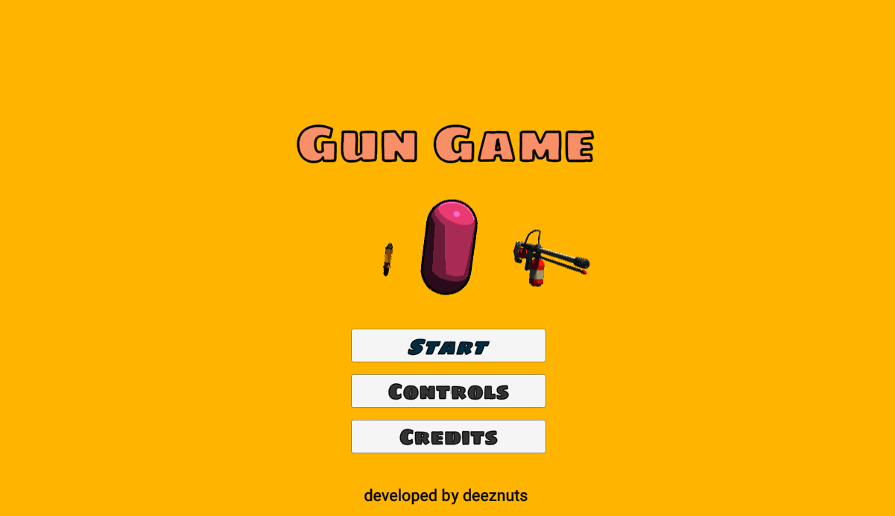
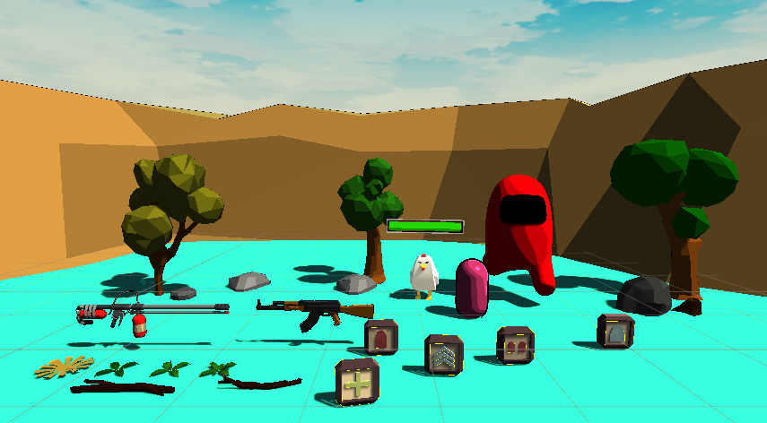
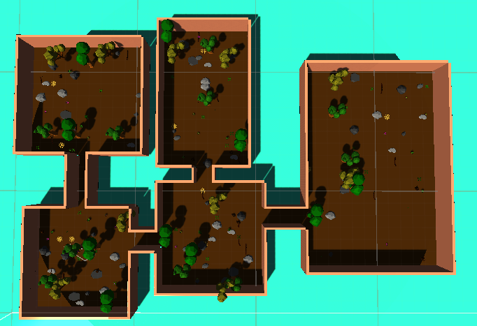
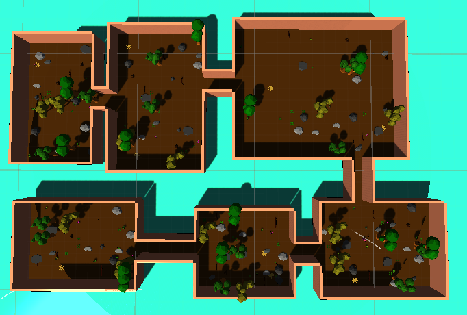
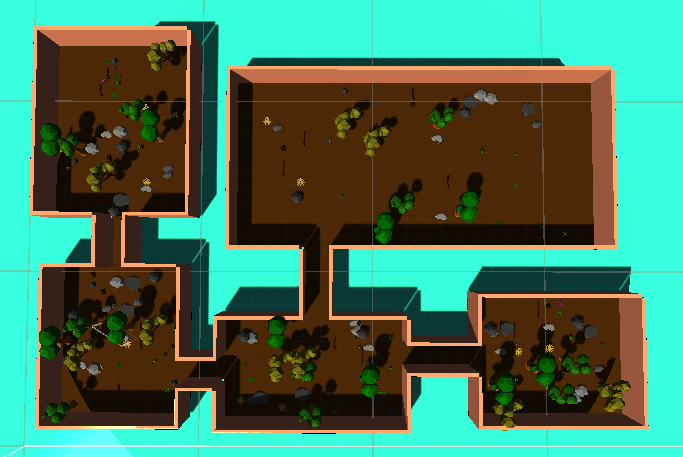
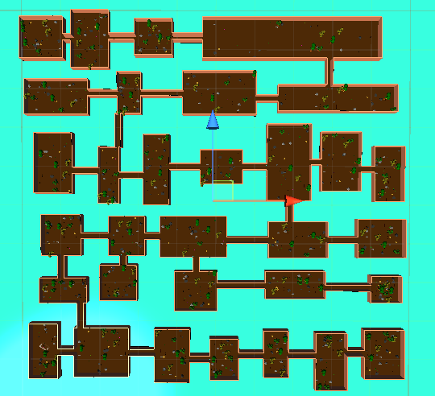
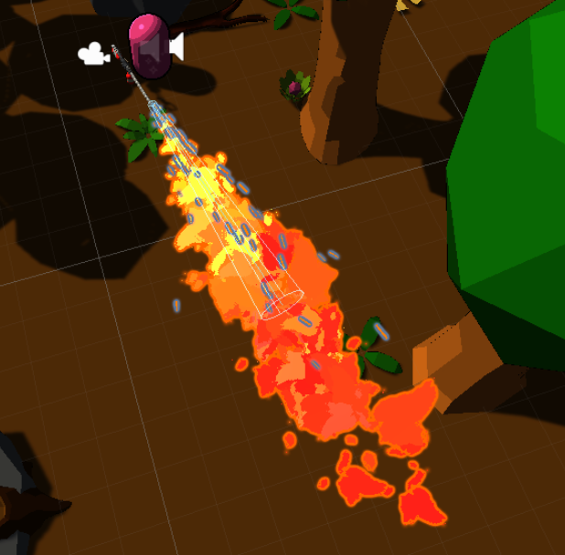

**The University of Melbourne**
# COMP30019 – Graphics and Interaction

## Teamwork plan/summary

<!-- [[StartTeamworkPlan]] PLEASE LEAVE THIS LINE UNTOUCHED -->

<!-- Fill this section by Milestone 1 (see specification for details) -->

### Tasks Overview

#### Player Movement and Camera *(Ian)*
- implement third-person camera view, camera movement, camera collision
- player input for character movement: jumping/double jump, dashing, strafing

#### UI Elements *(Ian)*
- health and ammo ui
- game menu ui
- game controller

#### Audio *(All)*
- game background music
- weapons sounds: fire, reload, etc.
- menu sounds
- character movement sounds

#### Weapon System *(Harry)*
- implement weapons (AK47 and Firethrower)
- basic functionality: left click to shoot, "R" to reload, "1" and "2" to switch weapons
- aim system
- weapon projectile
- particle system for flame effect (for firethrower)
- final boss: ability to throw rocks

#### Enemy System *(Jun)*
- enemy movement: speed, follow the player
- enemy spawn rate/location
- collision detections
- damage system
- health system


#### Environment *(Brian)*
- procedurally generate dungeon: dungeon size, rooms count, connect rooms, etc.
- place assets and prefabs on the procedurally generated dungeon.
- build the final boss scene.

#### Shaders *(Brian and Harry)*
##### Cel Shader *(Brian)*
- cel shading to have cartoonish effect
- makes the assets have consistent aesthetic

##### Pixel Shader *(Harry)*
- pixelate the screen when the player is dealt damage

<!-- [[EndTeamworkPlan]] PLEASE LEAVE THIS LINE UNTOUCHED -->

---

## Final report

### Table of contents
* [Game Summary](#game-summary)
* [How to play the game](#how-to-play-the-game)
* [Gameplay Decisions](#gameplay-decisions)
* [Graphical Assets](#graphical-assets)
* [Graphics Pipeline](#graphics-pipeline)
* [Procedural Generation](#procedural-generation)
* [Particle System](#particle-system)
* [Querying and Observational methods](#querying-and-observational-methods)
* [Changes made based on feedbacks](#changes-made-based-on-feedbacks)
  <!-- TODO: remove this part before submission -->
* [Using Images](#using-images)
* [Code Snipets](#code-snippets)
  <!-- -->
* [External Resources](#external-resources)
* [Technologies](#technologies)


### Game Summary
***Gun Game*** is a third-person arena shooter game where you have to defeat a bunch of enemies to beat the game. The game begins with you waking up in the middle of a maze-like dungeon where a bunch of chicken are constantly attacking you. After killing 20 of them, you suddenly got teleported onto a mysterious island where you are faced with a giant final boss (amongus imposter) who is throwing rocks at you. You have to defeat this weird giant imposter to finally win the game!

### How to play the game
#### Keybindings
The game uses fairly standard mouse and keyboard inputs:
- *WASD* to move the player
- *space* to jump
- moving the mouse moves the camera
- *left mouse button* to shoot
- *R* to reload
- numbers *1* and *2* allows you to switch the weapons

#### Navigation
When the game first loads, you are taken to a menu screen where you can start the game, view the controls, or the game credits.

<p align="center">
  
</p>

#### Task
Once you start the game, you have to kill 20 regular enemies (chickens). After that the final boss scene will be loaded and you have to defeat the final boss to win the game. During the game, killing the enemies will randomly drop you different powerups which will aids you in beating the game.


### Gameplay Decisions
#### Level design
The biggest design decision we made is how the level is going to be like. We knew we wanted a shooter game in the third person and so an arena first came to mind. However, an area would be a bit too basic and we wanted to include some procedural generation for the level, and so we thought of doing a maze of some kind. Whilst this would work, mazes tend to be quite small as it's just a bunch of corridors. We eventually came up with the idea of procedurally generating rooms and connecting them with corridors. This gives us much more space to decorate the rooms with objects and larger rooms give the player more freedom of movement.

#### Player and Camera controls
The next gameplay decision was how the player is going to be controlled. We opted for the standard mouse and keyboard controls, WASD, space, left mouse button, etc., as that is what most shooter games use. We could have added a controller option however we thought mouse and keyboard controls were best due to the accuracy of a mouse would fit the game much better than controller thumbsticks.

Another thing we had to consider is making the game with a first person perspective or third person perspective. Whilst the game can work with a first person perspective and easier as dealing with camera collision makes the camera movement a bit more complicated, making the game third person, gives the player a larger field of view allowing the player to see enemies on the sides more easily, making for a better gameplay experience.

Another design related decision that needs to be made in regards to the camera is how it is going to collide with the objects around it. An early implementation of camera collision was to check slightly behind the camera for objects, however, when using the position of the camera, as a start point of a linecast. Something like this,
``` C#
if(Physics.Linecast(camTransform.position + offset, camTransform.position - offset, out var hit))
{
  transform.position = hit.point;
}
 
```
will make the camera stick to the wall. This can be patched with checking if the player's distance from the camera gets to larger than the camera will move to its normal position, however, that is only a janky patch and not actually a fix as the gameplay experience isn't that great as the camera will suddenly move forwards.

Eventually we ended up going for a more simple route, which is just checking for objects between the player and camera. However, since the player is also an object we must include a slight offset so the linecast avoids the player. Something like this
``` C#
  if(Physics.Linecast(playerTransform.position - offset, camTransform.position, out var hit))
  {
      camtransform.position = hit.point;
  }
```
Whilst this isn't a perfect solution, enemies or objects when close enough can mess with the camera position, it is a solution that works well enough and was easily implemented.

#### Boss level
A gameplay decision we had to make was how do we end the game? The game wasn't endless and so we decided to add in a boss enemy at the end. There are many ways of adding a boss enemy to a game, however, with how we did the level design, much more thought was needed to determine the best way to add the boss. For example, what room do we add the boss? At what point in the game do we add the boss? These were the big questions we had to think about. We first thought about adding the boss in the biggest room that was generated. However, due to the nature of how the level was generated we couldn't guarantee a large room since we wanted to make the boss large in comparison to the player. We could've figured out a way to generate a predetermined size room specifically for the boss but adding that into the dungeon generator made it too complicated. And so, rather than making the boss a part of the dungeon we decided to make the boss its own scene. With the boss having its own scene, we could design the level specifically for the boss and not have to worry about the limitations of the dungeon generator as we can design the level to the needs of the boss. 

The next decision we had to make was how to transition from the dungeon level to the boss level. There was a couple of ways to do this, the first is a time limit, which can be implemented quite easily, however, we wanted the player to be able to explore the dungeon at their own leisure, and with different dungeon sizes, the time limit needs to be altered which adds to unnecessary coupling. We ended up deciding on using a kill counter to determine when the player will transition to the boss level. We also thought about using the number of rooms cleared but that would still be the equivalent to a kill counter, and if we decided to make the game more maze like the player wouldn't need to clearevery room completely to transition to the boss level.

#### Weapon Aiming System
One of the issues we faced was to make the weapons aim vertically in third-person view. This is easier to implement in first-person view but in third-person, the causes issues with the camera rotations when trying to aim vertically.

Therefore, we decided to stick to horizontal aiming. To allow the player to shoot higher (e.g. a very tall final boss), we decided to implement powerups system that allows the player to jump really high.


### Graphical Assets
> Path: *Assets/External*

Since all the team members lack experience with drawing and making models, most graphical assets are downloaded from Sketchfab and Unity Assets Store. However, to achieve consistent aesthetic, all assets are using the materials with our own custom shaders (more about it at [Graphics Pipeline](#graphics-pipeline)).

<p align="center">
  
</p>

For credits please refer to the [External Resources](#external-resources) section.


### Graphics Pipeline
#### Cel Shader
> Path: *Assets/Code/Shaders/CelShader.shader*

We used cel shading technique to create fun and cartoonish aesthetic to our game.

Some features of our cel shader:
- object glossiness
- rim effect using Fresnel around the objects
- different number of shadow steps and sizes
- customizable outlines (some objects have thicker outline with distinct colors to make it pop more. e.g. Powerups)

Why Cel shading?
- Since our team lack member who have experience with creating our own assets (in blender for example), we decided to mostly download free assets from different sources. Using the cel shading technique helped us make the aesthetic of all the assets more consistent and do not make them look out of place. For the assets, we mostly use low poly assets (objects made with low polygon count with flat surfaces) since we want to make the game look cartoonish and simple. Therefore, the cel shading technique matches more with these low poly assets, making the game looks simple yet looks good.

#### Pixelated Shader
> Path: *Assets/Code/Shaders/PixelationShader.shader*

We used pixeleated shader to provide sqecial visual effect when player is attacked by enemies.

- This shader is assigned to a material called "pixeleted" and controled by a script called pixelationShaderHandeller. It will enable picelated material when collision was detected and disabled after 2 seconds. 

- The aim of this pixelated shader is to blur the whole screen when player was attacked. 

- The team trying to assign this material to all the objects in the scene. However, we find it is very inefficiency and almost impossable to do so. Therefore, pixelated material was assigned to camera, which works as a filter. It turned out very efficient and easy to do so. 

How this be done
- the screen was divided to specific number of pixels with fixed width and height. Each pixcel was assigned to a texture which is extracted from the main texture. 

### Procedural Generation
For the level design, we wanted to create a dungeon that will be different each time the user plays the game (something like minecraft where the world will be different each time you start a new game). Therefore we decided to use procedural generation to randomly generate rooms. The main algorithm used is called Binary Space Partitioning.

The high level overview of the algorithm is: 
1. first we define the space where we want to generate the entire dungeon.
2. after that, the parent room is divided into smaller rooms if the is larger than the minimum room size that we defined (we set some offsets so the rooms created are of different sizes)
3. repeat step 2 until all rooms are small enough and can not be divided further.
4. to build the corridors that connect the rooms (and ensure that all rooms can be reached by the player), we connect the parent node with its children nodes in the tree construct when splitting the room.

After applying this procedural generation algorithm, we simply place the prefab assets onto the scene at random positions on the map. Since we are just using premade assets of the natural environment (trees, rocks, etc.), spawing them at random positions make sense.

#### Sample Rooms
<p align="center">
  
  
  
</p>

This algorithm can be used to easily generate dungeons **as large as you want** and as complicated by adjusting the parameters. However, we decided to generate a smaller and less complicated dungeon consisting of around 5 or 6 rooms since we do not want to make the player spend a long time defeating smaller enemies before reaching the final boss scene.

<p align="center">
  
</p>


### Particle System
> Path: *Assets/Level/Prefabs/Effects/FlameThrowerEffect.prefab*

<p align="center">
  
</p>

This flame particle system is made into cartoonish style on purpose in order to match our game aesthetic. 

Attributes were changed based on the apperence of the flame. 

#### Attributes varied
-  Start lifetime was randomed between 1 and 2. This attribute is worked with start speed to make sure the flame has reasonable length. The randomness of lifetime makes sure the flame particle die out naturally.
-  Max particles was set to 3000 to make flame look good.
-  Shape of particle system is set to cone shape, with radius 0.1 and angle 1. This is can enable all the particles bounds together.
-  Color over lifetime was from yellow to red in order to mimic flame. 
-  Size over lifetime is from the small to larger. 
-  Texture Sheet animation is assgined to a sprite in order to make flame looks more realistic. 

Another particle system "FireEmbers" was add under the hariachy of this flame particle system to make it looks nice. 


### Querying and Observational methods
Lorem Ipsum


### Changes made based on feedbacks
Lorem Ipsum


### Technologies
Project is created with:
* Unity 2022.1.9f1 
* Ipsum version: 2.33
* Ament library version: 999

<!-- [[TODO]] REMOVE THIS PART BEFORE SUBMISSION -->
### Using Images

You can include images/gifs by adding them to a folder in your repo, currently `Gifs/*`:

<p align="center">
  
</p>

To create a gif from a video you can follow this [link](https://ezgif.com/video-to-gif/ezgif-6-55f4b3b086d4.mov).

### Code Snippets 

You may wish to include code snippets, but be sure to explain them properly, and don't go overboard copying
every line of code in your project!

```c#
public class CameraController : MonoBehaviour
{
    void Start ()
    {
        // Do something...
    }
}
```
<!-- -->


### External Resources
- https://www.youtube.com/watch?v=zVX9-c_aZVg
- https://www.youtube.com/watch?v=CSuvGGiC2wI
- https://docs.unity3d.com/ScriptReference/CharacterController.Move.html

#### For Procedural generation
- https://www.youtube.com/watch?v=JSRBdUhRBu4
- https://www.jamesbaum.co.uk/blether/procedural-generation-with-binary-space-partitions-and-rust/
- https://medium.com/@guribemontero/dungeon-generation-using-binary-space-trees-47d4a668e2d0

#### For Cel shading
- https://www.youtube.com/watch?v=kV4IG811DUU&t=250s
- https://danielilett.com/2019-05-29-tut2-intro/
- https://roystan.net/articles/toon-shader/
- https://www.ronja-tutorials.com/post/032-improved-toon/#specular-highlights

#### For Weapon System
- https://www.youtube.com/watch?v=Cwe-GV1OM3k
- https://www.youtube.com/watch?v=om-SS-CBZ8g&t=3s

#### For External Assets
- Crewmate model: https://sketchfab.com/3d-models/imposter-among-us-5ce5a5172ffc4f88adb11aff8a58b541
- Control Icons: https://thoseawesomeguys.com/prompts/
- Environment Props: https://assetstore.unity.com/packages/3d/environments/landscapes/lowpoly-environment-pack-99479
- Powerup Assets: https://assetstore.unity.com/packages/3d/props/low-poly-powerups-212079
- Custom Skybox: https://assetstore.unity.com/packages/2d/textures-materials/sky/free-stylized-skybox-212257
- Menu Sound: https://mixkit.co/free-sound-effects/game/
- Ak47 Sound: https://mixkit.co/free-sound-effects/game/
- Power Up Sound: https://mixkit.co/free-sound-effects/game/
- Dash Sound: https://mixkit.co/free-sound-effects/whoosh/
- Flamethrower Sound: QuickSound.com
- Walking Sound: FesliyanStudio.com